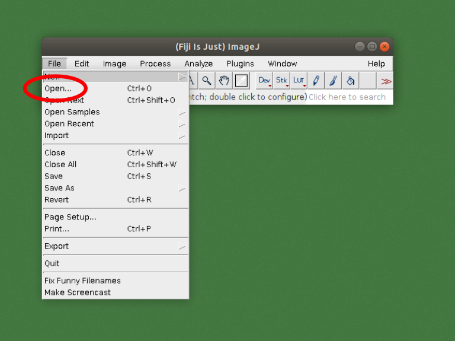
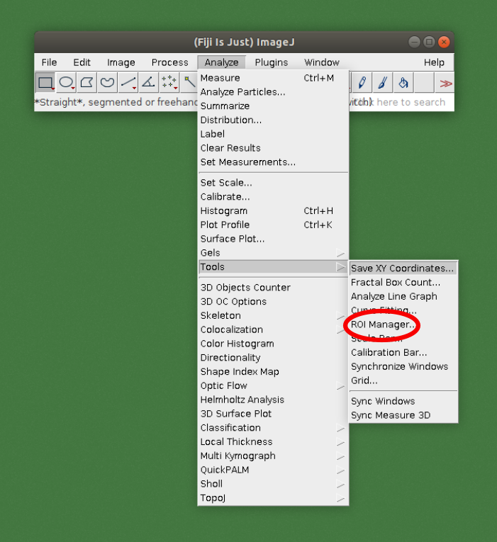
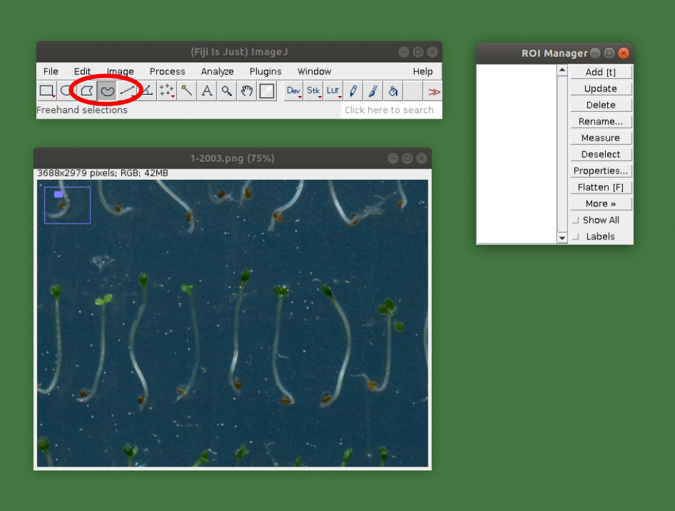
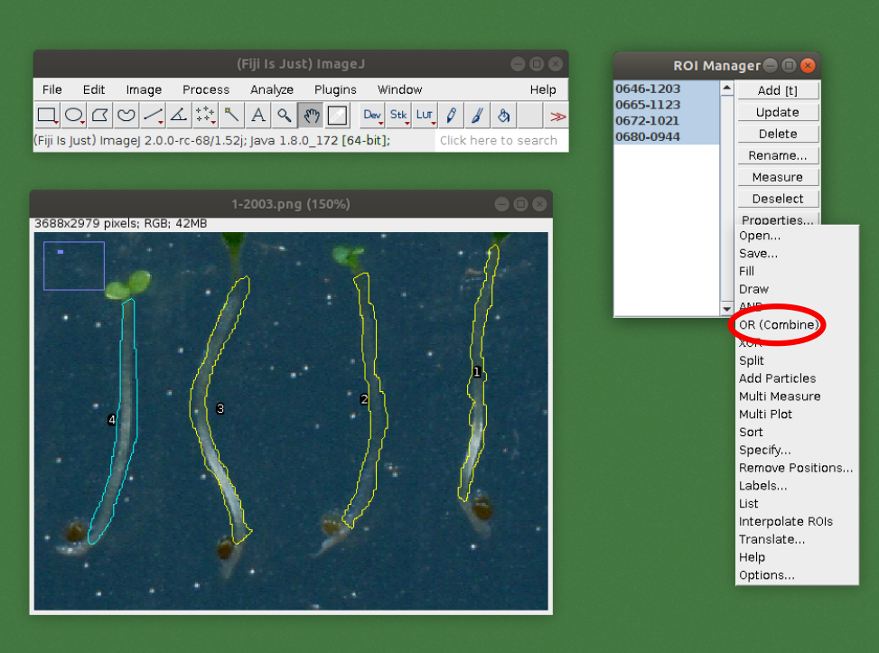
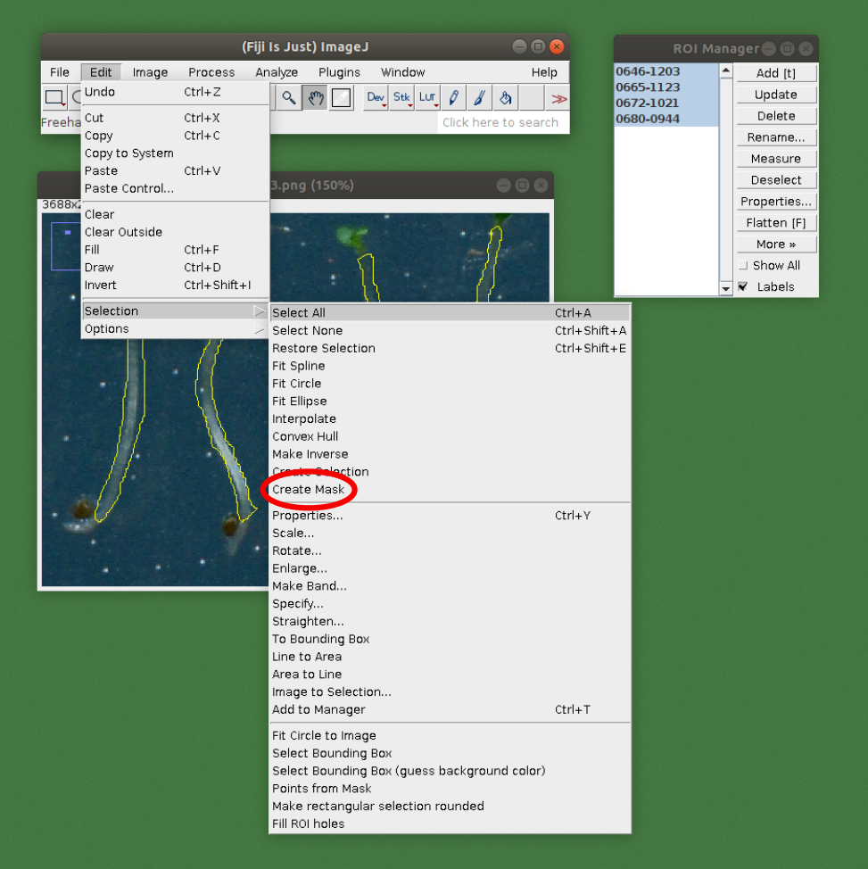
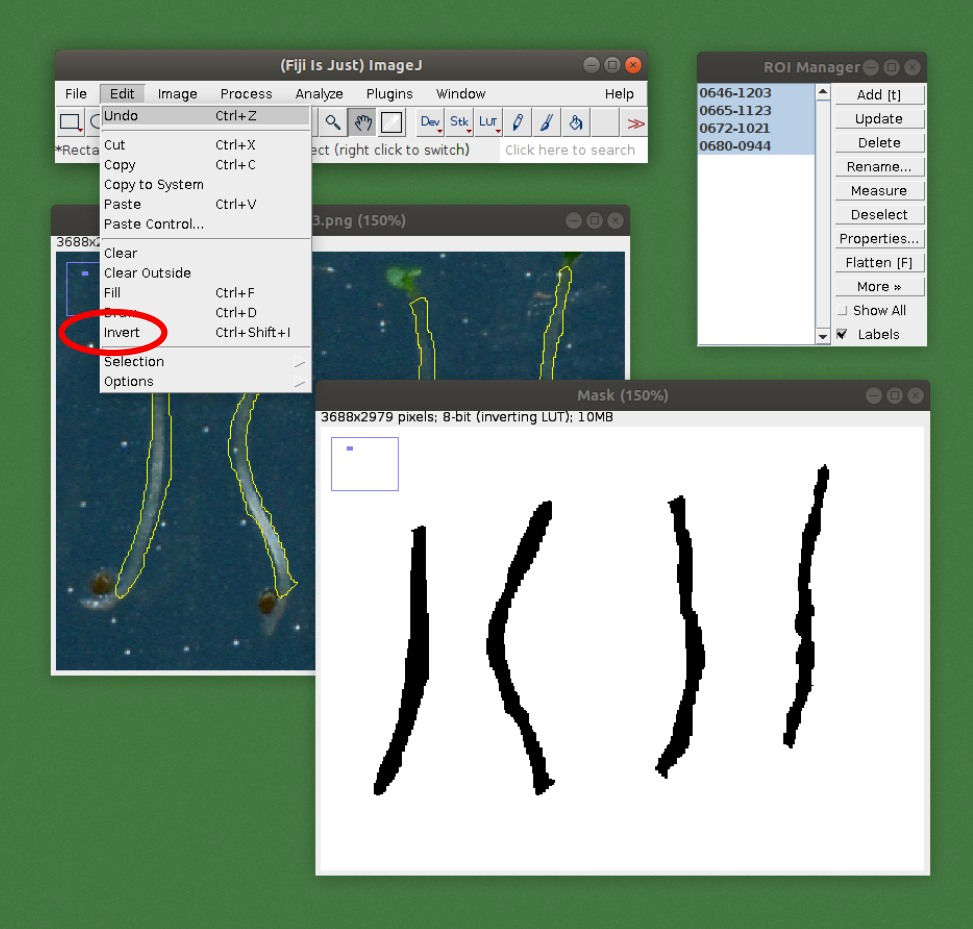
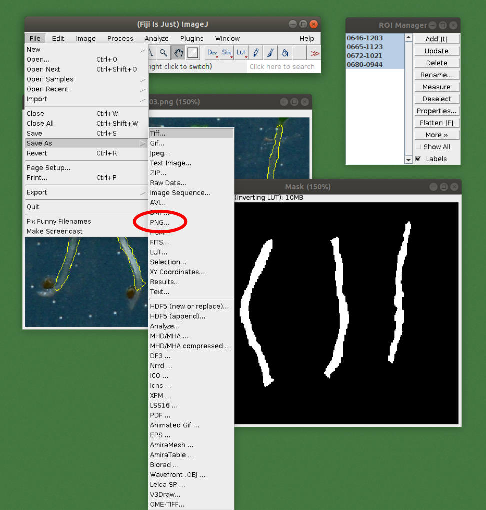
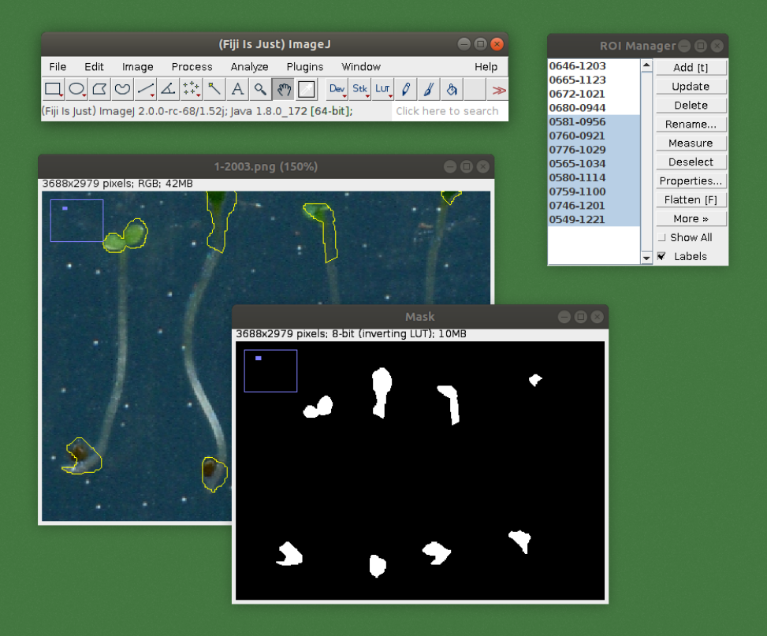

# A deep learning-based approach for high throughput plant phenotyping

## Contents
- [Usage, dependencies](#usage)
- [Using a trained model for measuring hypocotyls](#measuring)
- [Generating your own training data](#annotating)
- [Training a model on your own images](#training)

## Usage, dependencies <a name="usage"></a>
For measuring hypocotyls and training a custom model, it is required to have
- Python >= 3.5
- PyTorch >= 0.4
- NumPy >= 1.13
- Pandas >= 0.23
- scikit-image >= 0.14
- matplotlib >= 3.0

To use the hypocotyl segmentation tool, clone the repository to the local machine:
```bash
git clone https://github.com/biomag-lab/hypocotyl-UNet
```
`src/measure.py` can be used for applying the measuring algorithm on custom images, while `src/train.py` are for training the UNet model on custom annotated data. (Detailed description on them can be found below.)

## Using a trained model for measuring hypocotyls <a name="measuring"></a>
To apply the algorithm on custom images, the folder containing the images should be organized into the following directory structure:
```bash
images_folder
   |-- images
       |-- img001.png
       |-- img002.png
       |-- ...
```
The `src/measure.py` script can be used to run the algorithm. The required arguments are
- `--images_path`: path to the images folder, which must have the structure outlined above.
- `--model`: path to the UNet model used in the algorithm. Pretrained models are available in the `models` folder.
- `--result_folder`: path to the folder where results will be exported.  

Additionally, you can specify the following:
- `--min_object_size`: the expected minimum object size in pixels. Default is 0. Detected objects below this size will be filtered out.
- `--max_object_size`: the expected maximum object size in pixels. Default is `np.inf`. Detected objects above this size will be filtered out.
- `--dpi` and `--dpm`: to export the lengths in *mm*, it is required to provide a *dpi* (dots per inch) or *dpm* (dots per millimeter) value. If any of this is available, the pixel units will be converted to *mm* during measurements. If both *dpi* and *dpm* is set, only *dpm* will be taken into account.
- `--device`: device to be used for the UNet prediction. Default is `cpu`, but if a GPU with the CUDA framework installed is available, `cuda:$ID` can be used, where `$ID` is the ID of the GPU. For example, `cuda:0`. (For PyTorch users: this argument is passed directly to the `torch.Tensor.device` object during initialization, which will be used for the rest of the workflow.)
- `--visualize`: set to True to export a visualization of the results. For each measured image, the following images are exported along with the length measurements.  
  

For instance, an example is the following:
```bash
python3 measure.py --images_path path_to_images \
    --model ../models/unet \
    --result_folder path_to_results \
    --device cuda:0
```

## Generating your own training data <a name="annotating"></a>
In case the algorithm performs poorly, for instance if the images were taken under very different conditions than the ones provided to the available model during training, the UNet backbone model can be retrained on custom data. This process is called *annotation*, which can be done easily with ImageJ.

Step 1. Organize your images to be annotated such that each image is contained in a separate folder with common root. The folder should be named after the image. For example:
```bash
images_folder
   |-- image_1
       |-- image_1.png
   |-- image_2
       |-- image_2.png
   |-- ...
```

Step 2. Open the image to be annotated in ImageJ.  


Step 3. Open the *ROI manager* tool.  


Step 4. Select an appropriate selection tool, for example *Freehand selections*.  


Step 5. Draw the outline of the part which is part of the plant and should be included during the measurements. Press *t* or click on the *Add [t]* button to add the selected part to the ROI manager.  


Step 6. Repeat the outlining with all of the selections, adding them one by one. When it is done, select all and click *More > OR (Combine)*.  


Step 7. Press *Edit > Selection > Create Mask*. This will open up a new image.  


Step 8. Invert the mask image by pressing *Edit > Invert* or pressing *Ctrl + Shift + I*.  


Step 9. Save the mask image to the folder with the original. Add the suffix *-hypo* to the name. For example, if the original name was *image_1.png*, this image should be named *image_1-hypo.png*.  


Step 10. Repeat the same process to annotate the parts of the plant which should not be included in the measurements. Save the mask to the same folder. Add the suffix *-nonhypo* to the name.  


Step 11. Create the training data for the algorithm by running the `src/preprocessing/mask.py`. The required arguments are
- `--images_folder`: path to the folder where the folders containing the images and masks located.
- `--export_folder`: path to the folder where the results should be exported.
- `--make_patches`: True if images and masks are to be patched up to smaller pieces. Recommended for training.

## Training a model on your own images <a name="training"></a>
If custom annotated data is available, the containing folder should be organized into the following directory structure:
```bash
images_folder
   |-- images
       |-- img001.png
       |-- img002.png
       |-- ...
   |-- masks
       |-- img001.png
       |-- img002.png
       |-- ...
```
The mask images should have identical name to their corresponding image. After the training data is organized, the `src/train.py` script can be used to train a custom UNet model. The required arguments are
- `--train_dataset`: path to the folder where the training data is located. This should match with the `--export_folder` argument given to the `src/preprocessing/mask.py` script during Step 11. of the previous point.

The optional arguments are
- `--epochs`: the number of epochs during training. Default is 1000, but this is very dependent on the dataset and data augmentation method used.
- `--batch_size`: the size of the batch during training. Default is 1. If GPU is used, it is recommended to select batch size as large as GPU memory allows.
- `--initial_lr`: initial learning rate. Default is 1e-3, which proved to be the best for the training dataset used. (Different datasets might have more optimal initial learning rates.)
- `--model_name`: name of the model. Default is *UNet-hypocotyl*.
- `--trained_model_path`: to continue training of a previously trained model, its path can be given.
- `--val_dataset`: path to the folder where the validation data is located. During training, validation data is used to catch overfitting and apply early stopping.
- `--model_save_freq`: frequency of model saving. Default is 200, which means that the model is saved after every 200th epoch.
- `--device`: device to be used for the UNet training. Default is `cpu`, but if a GPU with the CUDA framework installed is available, `cuda:$ID` can be used, where `$ID` is the ID of the GPU. For example, `cuda:0`. (For PyTorch users: this argument is passed directly to the `torch.Tensor.device` object during initialization, which will be used for the rest of the workflow.)

